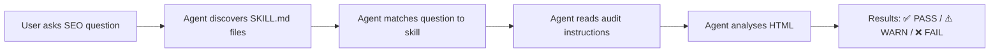

<p align="center">
  <h1 align="center">🔍 nextjs-seo-audit</h1>
  <p align="center">
    <strong>AI Agent Skills for automated SEO auditing — zero dependencies, zero setup.</strong>
  </p>
  <p align="center">
    11 <code>SKILL.md</code> files that teach AI coding agents how to perform comprehensive, industry-standard SEO audits on any HTML page.
  </p>
</p>

<p align="center">
  <a href="https://github.com/thisisAhsanIqbal/nextjs-seo-audit/stargazers"></a>
  <a href="https://github.com/thisisAhsanIqbal/nextjs-seo-audit/network/members"></a>
  <a href="https://github.com/thisisAhsanIqbal/nextjs-seo-audit/issues"></a>
  <a href="https://github.com/thisisAhsanIqbal/nextjs-seo-audit/blob/main/LICENSE"></a>
  <a href="https://github.com/thisisAhsanIqbal/nextjs-seo-audit/commits/main"></a>
</p>

<p align="center">
  <sub>Works with</sub><br/>
  <a href="https://cursor.com">Cursor</a> · <a href="https://claude.ai/code">Claude Code</a> · <a href="https://code.visualstudio.com">VS Code Copilot</a> · <a href="https://geminicli.com">Gemini CLI</a> · <a href="https://roocode.com">Roo Code</a> · <a href="https://ampcode.com">Amp</a> · <a href="https://agentskills.io/">Any Agent Skills-compatible tool</a>
</p>

---

## ✨ What is this?

**nextjs-seo-audit** is an open-source collection of **AI Agent Skills** that enables any compatible AI coding assistant to perform **professional-grade SEO audits** — covering everything from on-page optimization and schema markup to Core Web Vitals and international SEO.

### How is it different?

- 🚫 **No code to run** — the AI agent reads instructions and audits using its own capabilities
- 📦 **No dependencies** — just `SKILL.md` files, nothing to install
- 🤖 **Multi-agent compatible** — works with Cursor, Claude Code, VS Code Copilot, Gemini CLI, and more
- 📋 **Industry-standard thresholds** — based on Google's guidelines, Lighthouse, and WCAG
- ✅ **Actionable results** — every check returns ✅ PASS, ⚠️ WARN, or ❌ FAIL with fix instructions

---

## 📦 Skills Included

| # | Skill | What it audits | Key checks |
|---|-------|---------------|------------|
| 🏠 | **[Root Orchestrator](SKILL.md)** | Full 10-area audit | Runs all skills, generates summary report |
| 1 | **[On-Page Optimization](skills/onpage-optimization/SKILL.md)** | Content & structure | H1 tags, keyword density, internal links, content length |
| 2 | **[Schema / JSON-LD](skills/schema-json-optimization/SKILL.md)** | Structured data | JSON-LD validation, Article & LocalBusiness schema, rich snippets |
| 3 | **[Meta Data](skills/meta-data-optimization/SKILL.md)** | Meta tags | Title length, description, Open Graph, Twitter Cards |
| 4 | **[Semantic Layout](skills/semantic-layout/SKILL.md)** | HTML structure | HTML5 elements, ARIA landmarks, accessibility, div-soup detection |
| 5 | **[Site Speed](skills/site-speed-optimization/SKILL.md)** | Performance | Render-blocking scripts, inline CSS, image optimization |
| 6 | **[Mobile Optimization](skills/mobile-optimization/SKILL.md)** | Mobile UX | Viewport meta, responsive design, touch targets, font sizing |
| 7 | **[Backlink Monitoring](skills/backlink-monitoring/SKILL.md)** | Link profile | Dofollow/nofollow ratio, domain diversity, anchor text analysis |
| 8 | **[International SEO](skills/international-seo/SKILL.md)** | Multi-language | Hreflang tags, language targeting, regional URL structure |
| 9 | **[Technical SEO](skills/technical-seo/SKILL.md)** | Crawlability | Sitemap, robots.txt, canonical tags, redirect chains |
| 10 | **[Core Web Vitals](skills/core-web-vitals/SKILL.md)** | Performance metrics | LCP, CLS, INP, Lighthouse performance scoring |

---

## 🚀 Quick Start

### 1. Clone into your project

```bash
git clone https://github.com/thisisAhsanIqbal/nextjs-seo-audit.git .agent/skills/nextjs-seo-audit
```

Or add as a **Git submodule** (recommended for teams):

```bash
git submodule add https://github.com/thisisAhsanIqbal/nextjs-seo-audit.git .agent/skills/nextjs-seo-audit
```

### 2. Ask your AI agent

That's it — no configuration needed. Your AI agent will automatically discover the `SKILL.md` files. Try prompts like:

```
"Run a full SEO audit on this page"
"Check schema markup on my homepage"
"Is my site mobile-friendly?"
"Audit the meta tags for this page"
"What are my Core Web Vitals issues?"
```

---

## 🤖 Compatible AI Agents

| Agent | Discovery method |
|-------|-----------------|
| **[Cursor](https://cursor.com)** | Scans workspace for `SKILL.md` files |
| **[Claude Code](https://claude.ai/code)** | Auto-discovers `SKILL.md` in workspace |
| **[VS Code Copilot](https://code.visualstudio.com)** | Reads `SKILL.md` from workspace |
| **[Gemini CLI](https://geminicli.com)** | Scans project for skills at startup |
| **[Roo Code](https://roocode.com)** | Discovers via workspace root |
| **[Amp](https://ampcode.com)** | Auto-discovered in workspace |
| **[Goose](https://goose.ai)** | Configured skill directories |

---

## 📁 Project Structure

```
nextjs-seo-audit/
├── SKILL.md                              # Root orchestrator — runs full audit
├── README.md
├── LICENSE
├── CONTRIBUTING.md
└── skills/
    ├── onpage-optimization/SKILL.md      # H1, keywords, internal links
    ├── schema-json-optimization/SKILL.md # JSON-LD, structured data
    ├── meta-data-optimization/SKILL.md   # Title, OG, Twitter Cards
    ├── semantic-layout/SKILL.md          # HTML5, ARIA, accessibility
    ├── site-speed-optimization/SKILL.md  # Scripts, CSS, images
    ├── mobile-optimization/SKILL.md      # Viewport, touch targets
    ├── backlink-monitoring/SKILL.md      # Link profile analysis
    ├── international-seo/SKILL.md        # Hreflang, i18n
    ├── technical-seo/SKILL.md            # Sitemap, robots, canonical
    └── core-web-vitals/SKILL.md          # LCP, CLS, INP
```

---

## ⚙️ How It Works



1. **Discovery** — Agent finds `SKILL.md` files at startup and loads metadata (name + description)
2. **Matching** — When you ask an SEO question, the agent routes to the relevant skill(s)
3. **Auditing** — The agent reads detailed instructions with exact rules, thresholds, and checklists
4. **Reporting** — Results are reported as ✅ PASS / ⚠️ WARN / ❌ FAIL with actionable fixes

---

## 🤝 Contributing

Contributions are welcome and appreciated! Here's how you can help:

### Ways to contribute

- 🐛 **Report bugs** — [Open an issue](https://github.com/thisisAhsanIqbal/nextjs-seo-audit/issues/new) if a check has incorrect thresholds or missing rules
- 💡 **Suggest new checks** — Have an SEO check we missed? Open a feature request
- ✍️ **Improve existing skills** — Tighten thresholds, add edge cases, improve wording
- 📝 **Add new skills** — Want to add a skill for Image SEO, Video SEO, or E-E-A-T? PRs welcome!
- 📖 **Improve documentation** — Fix typos, add examples, clarify instructions

### Contribution guidelines

1. **Fork** this repository
2. **Create a branch** for your change (`git checkout -b feature/my-new-check`)
3. **Follow the existing format** — every `SKILL.md` uses YAML frontmatter + markdown tables
4. **Test with an AI agent** — make sure the skill works when an agent reads it
5. **Submit a PR** with a clear description of the change

### Skill authoring format

Every skill follows this structure:

```yaml
---
name: skill-name
description: One-line description of what this skill audits
author: Your Name
license: MIT
---
```

Followed by markdown with audit instructions, thresholds, and reporting format.

---

## 📊 SEO Areas Covered

This project covers all major areas of **Search Engine Optimization**:

- **On-Page SEO** — content optimization, heading structure, keyword analysis
- **Technical SEO** — crawlability, indexability, sitemap, robots.txt
- **Schema Markup** — JSON-LD structured data, rich snippets eligibility
- **Meta Tags** — title tags, meta descriptions, Open Graph, Twitter Cards
- **Core Web Vitals** — LCP, CLS, INP, page speed optimization
- **Mobile SEO** — responsive design, viewport, touch-friendly UI
- **International SEO** — hreflang, multi-language, regional targeting
- **Site Speed** — render-blocking resources, image optimization, CSS delivery
- **Semantic HTML** — accessibility, ARIA, HTML5 landmark elements
- **Backlink Analysis** — link profile health, anchor text diversity

---

## ⭐ Show Your Support

If this project helps you build better SEO practices into your workflow, please consider:

- ⭐ **Starring** this repository
- 🍴 **Forking** to customize for your needs
- 📣 **Sharing** with your team or on social media
- 🐛 **Opening issues** for bugs or ideas

---

## 👤 Author

**Muhammad Ahsan Iqbal** — Digital Strategy & SEO Expert

- 🌐 [muhammadahsaniqbal.com](https://muhammadahsaniqbal.com/)
- 💼 [LinkedIn](https://www.linkedin.com/in/ahsan-iqbal-digitalmarketingexpert/)
- 🐙 [GitHub](https://github.com/thisisAhsanIqbal)

---

## 📄 License

This project is licensed under the **MIT License** — see the [LICENSE](LICENSE) file for details.

---

<p align="center">
  Made with ❤️ for the SEO & AI community
</p>
